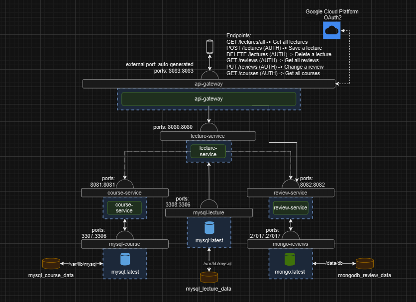
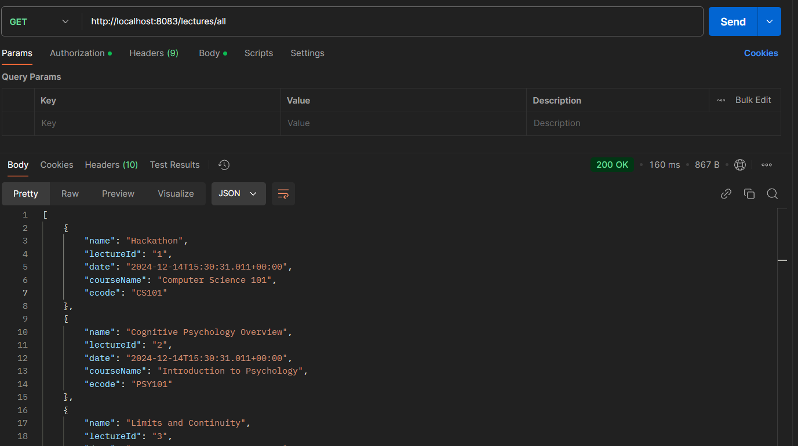
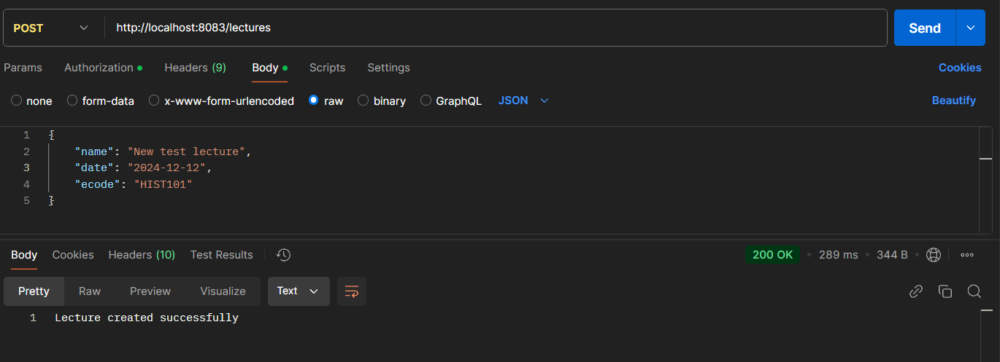
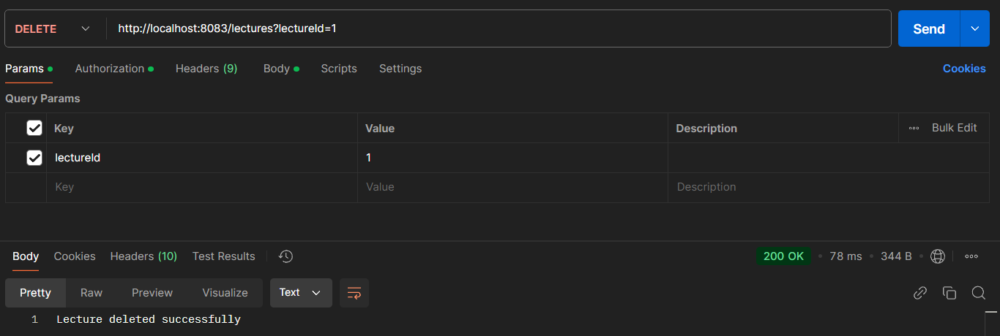
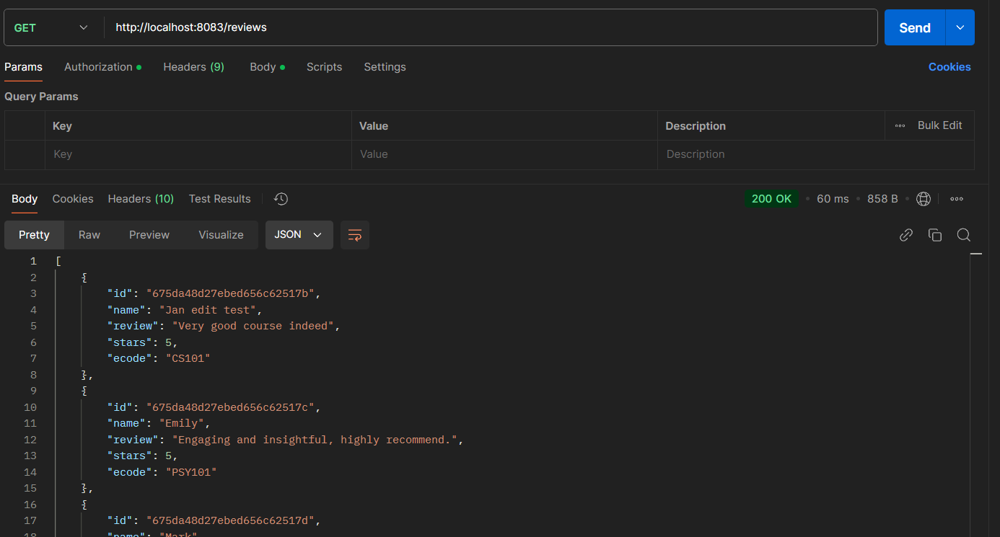
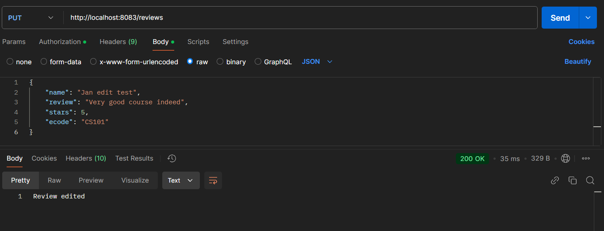
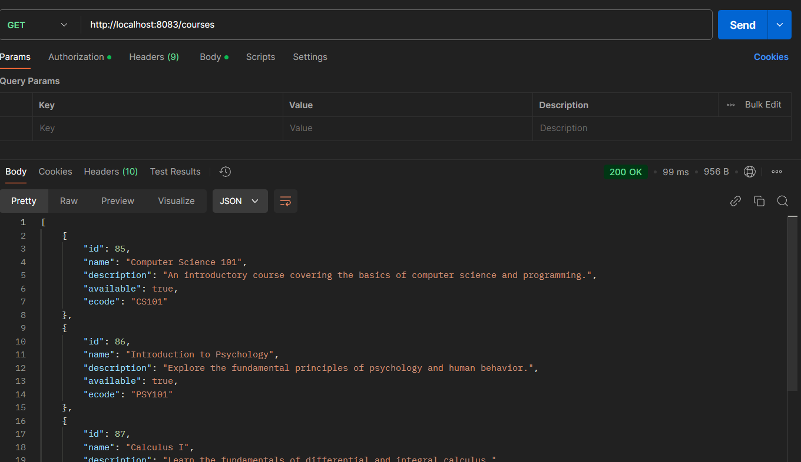

# Microservices for Lecture Management with Courses and Reviews

This system is built around microservices architecture to manage lectures, courses, and reviews. It allows users to fetch and create lectures, with each lecture being associated with a specific course or review through an eCode. Each lecture has a name, date (indicating when it takes place), and an eCode, which corresponds to certain courses or reviews. If the eCode already exists, the system responds with details about the specific course taking place. The system provides a central access point via an API Gateway, which routes requests to the appropriate microservices and manages authentication through OAuth2.

Currently only the lectures can be accessed unauthenticated.

Schema below:

# Available endpoints

- GET /lectures/all
- POST /lectures 
- DELETE /lectures
- GET /reviews
- PUT /reviews
- GET /courses

# Postman screenshots

- GET /lectures/all 

- POST /lectures

- DELETE /lectures

- GET /reviews

- PUT /reviews (requires correct/existing eCode)

- GET /courses

